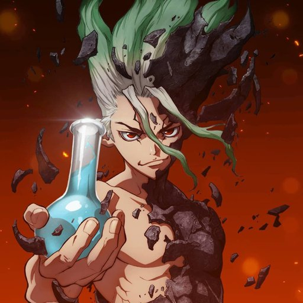
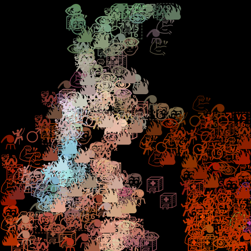

# Styling images with Genetic Algorithms
This work generates images consisting of emoticons that are based on image content. Genetic Algorithm with image difference (MSE) as a loss function is used to generate candidates.

  

# Instructions: how to run yourself?
1. Make sure you unpacked everything from the archive.
2. Open command line at that folder, and do the following command:
'python -m pip install -r requirements.txt' for Windows,
'pip install -r requirements.txt' for Linux.
3. In file 'projectConstants.py', in line 16, input the value for variable
'option'. This determines which picture EA will be run on.
'1'- Anime Man. '2' - Stones Sculpture. '3' - Rabbit. '4' - Dr. Brown on
Hockey Game (contest image).
4. If you want to test algorithm on custom picture, download it to
/reference_images folder. Then, option variable should be named like this
image, e.g. 'dr_stone.jpg'. To change emojis your image will be
drawn with, go to line 51 'pic_emojis', and 'custom' put words you
like.
5. Run 'main.py' and wait... result is saved every 50 generations, which
and each 50 generations take about 2 minutes.
6. Your results will be saved to /results/<your_image_name>_manual_testing/. Both
image results and side-by-side comparison is available.
7. To run anything new, just change 'option' and run again
